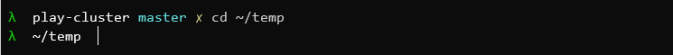
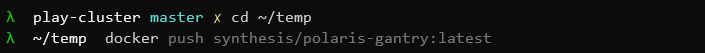

# Kubernetes Ninja

How to setup a ninja environment for kubernetes

## Linux shell

A power shell (not PowerShell) is essential for your ninja skills, you need a linux shell, believe me.  You don't need linux though, you can roll WSL:

- [Get Windows Subsystem for Linux](https://docs.microsoft.com/en-us/windows/wsl/install-win10)

## Terminal

Shell <> terminal, a terminal is a program that runs the shell. A emulator.  Windows just launched a great one:

- [Get Windows terminal](https://www.microsoft.com/en-us/p/windows-terminal-preview/9n0dx20hk701?activetab=pivot:overviewtab)

## `kubectl`

## `kubectx` & `kubens`

## `stern`

## Zsh

This is optional but... The ultimate ninja uses Z shell and https://ohmyz.sh/

I use the [Lambda gitster](https://github.com/ergenekonyigit/lambda-gitster) theme, with my favourite feature being the current working directory showing the root of the git repo when you cd into a git repo.



## Command History

This is your number one skill.  CTRL + R is your friend, you search through commands you've already run. My whole brain is stored in my linux shell history.

I also use [this](https://github.com/zsh-users/zsh-autosuggestions) for auto suggestions based on history:



## Folder structure

```sh
~ /.ssh
    - id_rsa
~ /.kube
    - config
~ /.aws
    - credentials
```

## 6. Tricks